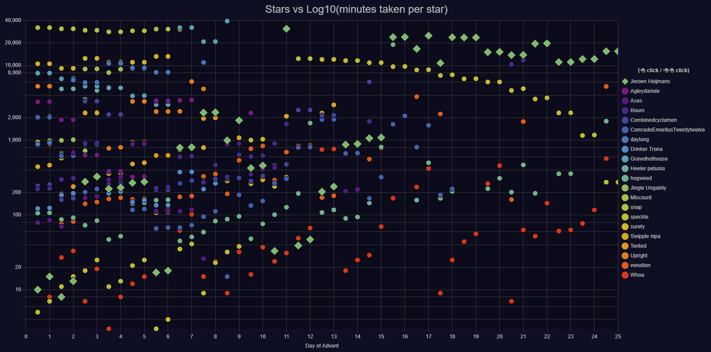

# Advent of Code Charts

This is an [unofficial](#license-and-affiliation-disclaimer) small hacked-up set of charts for a private leaderboard for [Advent of Code](https://adventofcode.com/).
Get it as an extension:

[](https://chrome.google.com/webstore/detail/advent-of-code-charts/ipbomkmbokofodhhjpipflmdplipblbe) [](https://addons.mozilla.org/en-US/firefox/addon/advent-of-code-charts/)

## Disclaimers

It is *not* a well-architectured, well-written, neat, nice, fluffy, industry-strength piece of code.
Instead it's something fun I wanted to make, stepping out of my *normal* way of coding. NO WARRANTY!

## Developing

Install dependencies:

```sh
npm ci # or npm install
```

Serve a test website with the dummy data:

```sh
npm run start # runs 'serve' and 'watch' in parallel
```

And open up the URL that's announced in the console.

## Building

Run `build.ps1` or `build.sh` to re-create a `/build` folder which is a ready-to-go browser extension.
Test the extension by loading it in the browser.
For full reference, see Chrome's or Firefox's full documentation, but the basics are:

- Firefox: go to `about:debugging` and load a temporary addon (pick the `/build` folder)
- Chrome: go to `chrome://extensions` and load unpacked extension (pick the `/build` folder)

Test by browsing to a private leaderboard and you should see charts popping up at the bottom.

## Releasing

To release an addon to the store, for Chrome you just zip the `/build` folder files into a file and submit it as a new version.

For Firefox, you need to add this to the manifest in the `/build` folder first:

```json
    "browser_specific_settings": {
        "gecko": {
            "id": "{GUID-GUID-GUID-GUID}"
        }
    }
```

For details see [Mozilla's documentation](https://developer.mozilla.org/en-US/docs/Mozilla/Add-ons/WebExtensions/manifest.json/browser_specific_settings) and [this Stack Overflow post](https://stackoverflow.com/q/56271601/419956) as to why it cannot be there by default.
(I suppose this step can be automated away later on.)

## License and Affiliation Disclaimer

The code in this project is MIT licensed, with the explicit exception of `dummyData.js`.
That file contains JSON in a format thought up by the owner and creator of Advent of Code, but we suppose that using a small snippet of it like this falls under "fair use" (given for one that the AoC website itself suggests using the "JSON API" for integrations, albeit without spamming that API).

Note that "Advent of Code" and "AoC" are Eric Wastl's.
This project is not "official", and in no way (directly or indirectly) endorsed by- or affiliated to Advent of Code and its creator/owner.
Read more [about Advent of Code](https://adventofcode.com/2018/about) to learn about the project itself.

**Oh, and of course, please [consider donating to _Advent of Code_ itself](https://adventofcode.com/support)!**

## Example

Here's what it should more or less look like:




